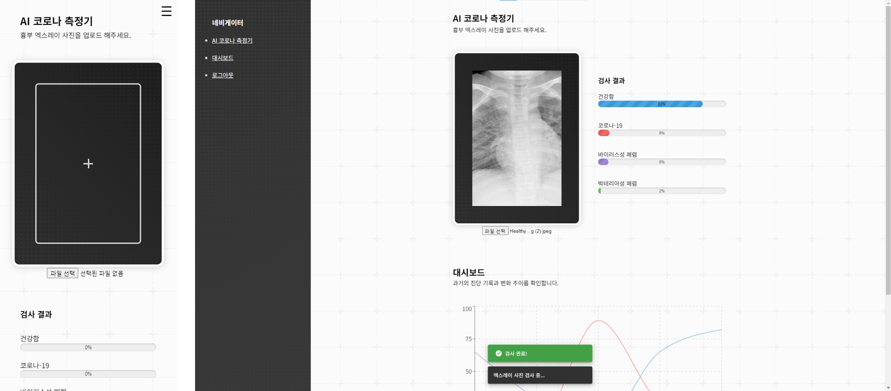

# AI 코로나19 검사기
## 소개
흉부 엑스레이 사진을 통한 코로나 바이러스 감염 여부 인공지능 판별 서비스

## 사용해보기
### 데모
AI 코로나19 검사기는 현재 버셀을 통해 배포 중입니다. [여기를 클릭해 사용해 보세요!](https://ai-covid-19-tester.vercel.app/sign/in)   
*더미 계정 (이메일: `user@example.com`, 비밀번호: `user1234`)*

### 로컬호스트
먼저, dev 서버를 실행시킵니다:

```bash
npm run dev
# or
yarn dev
# or
pnpm dev
```

브라우저로 [http://localhost:3000](http://localhost:3000)을 열어 결과를 확인할 수 있습니다.

`app/page.tsx`를 수정하여 페이지 편집을 시작할 수 있습니다. 파일을 편집하면 페이지가 자동으로 업데이트됩니다.

이 프로젝트는 [`next/font`](https://nextjs.org/docs/basic-features/font-optimization)를 사용하여 사용자 지정 Google Font인 Inter를 자동으로 최적화하고 로드합니다.

## 사용 방법
1. 로그인 혹은 회원가입을 합니다.
    - *더미 계정 (이메일: `user@example.com`, 비밀번호: `user1234`)*
1. 자신의 흉부 엑스레이 사진을 업로드 합니다.
1. AI가 측정한 결과를 확인합니다.
1. 일정한 주기로 엑스레이 사진을 업로드 하여, 감염 상태의 변화량을 그래프로 확인합니다.

## 기술
### AI 모델
- `TensorFlow.js`을 기반으로 동작하는 Google의 [`Teachable Machine`](https://teachablemachine.withgoogle.com/)으로 모델을 생성했습니다.
- [Kaggle](https://www.kaggle.com/)에서 라벨링된 흉부 엑스레이 사진 데이터셋을 수집했습니다. [수집한 데이터셋 링크](https://www.kaggle.com/datasets/pranavraikokte/covid19-image-dataset).
### 데이터베이스
- `Firebase`의 `Firestore`에 AI 모델이 반환한 데이터만을 저장합니다.
- `Firebase`의 `Authentication`으로 사용자 계정을 관리합니다.